# BioMed Zones v2 — Build Plan

> Question answered by the product: **"Where in France can species X be cultivated sustainably, and why?"**
> Scope: Metropolitan France (land + territorial sea to 12 nm) and the 5 DROM (Guadeloupe, Martinique, Guyane, Réunion, Mayotte). 9 species. H3 grid, resolutions 6 (national) and 7 (zoom).

## 1. Architecture

```mermaid
flowchart LR
  subgraph Sources["Public data sources (Phase 2)"]
    CMEMS[Copernicus Marine<br/>SST, salinity, O2, pH, chl-a]
    EMOD[EMODnet Bathymetry WCS]
    ETOPO[NOAA ETOPO 2022<br/>DROM bathymetry]
    OM[Open-Meteo<br/>ERA5 climate + Copernicus DEM elevation]
    SG[ISRIC SoilGrids WCS]
    PA[INPN / EEA Natura 2000<br/>+ French MPAs]
    CLC[Corine Land Cover 2018]
    NE[Natural Earth<br/>ports, cities, boundaries]
    MR[Marine Regions<br/>12 nm territorial sea]
    OCC[GBIF + OBIS occurrences]
  end

  subgraph Pipeline["data/pipeline (Python 3.11)"]
    ING[one ingestion module per source<br/>raw/ + clean/ + provenance.json]
    GRID[H3 grid builder res 6/7]
    AGG[feature aggregation to H3]
  end

  SNAP[(data/snapshot<br/>compressed Parquet + GeoParquet)]

  subgraph DB["PostgreSQL 16 + PostGIS 3 (+ h3-pg)"]
    T1[cells / cell_features / provenance]
    T2[species / occurrences]
    T3[scores / model_runs / metrics]
    T4[users / contributions / audit_log]
  end

  subgraph ML["services/ml (FastAPI)"]
    EXP[expert score]
    SDM[LightGBM + LogReg SDM<br/>spatial block CV, SHAP]
    FIN[final score + modifiers]
  end

  subgraph API["apps/api (Express + Prisma)"]
    REST[REST + OpenAPI /docs<br/>auth, roles, GDPR, PDF]
  end

  WEB["apps/web (React 18 + Vite)<br/>MapLibre + deck.gl H3HexagonLayer"]
  NGINX[nginx gateway]

  Sources --> ING --> GRID --> AGG --> DB
  AGG -- export --> SNAP
  SNAP -- make demo / offline --> DB
  DB <--> ML
  DB <--> API
  API -- /admin/retrain proxy --> ML
  NGINX --> WEB
  NGINX --> API
  NGINX --> ML
  User((Explorer / Contributor / Admin)) --> NGINX
```



### Runtime services (`docker compose up`)

| Service    | Image / build              | Role                                                         | Port (host) |
|------------|----------------------------|--------------------------------------------------------------|-------------|
| `db`       | `infra/db/Dockerfile`      | Postgres 16 + PostGIS 3 + h3-pg                              | 5432        |
| `migrate`  | `apps/api` image (one-shot)| `prisma migrate deploy` + seed                              | —           |
| `pipeline` | `data/pipeline` image (one-shot) | loads `data/snapshot` (or live ingestion with `--live`) | —           |
| `ml`       | `services/ml`              | FastAPI scoring / training / SHAP                            | 8001        |
| `api`      | `apps/api`                 | Express REST API                                             | 3001        |
| `web`      | `apps/web` + nginx         | SPA + reverse proxy (`/api` → api, `/ml` → ml)               | 8080        |

### Data flow and ownership
- **Schema owner: Prisma migrations** (single source of truth for every table, including spatial ones, using raw SQL for PostGIS/H3 columns). Python writes with `psycopg` into those tables.
- **Provenance**: every feature value row carries `provenance_id` → `provenance` table (source, URL, license, retrieval date, spatial/temporal resolution, checksum of raw file).
- **Snapshot**: the pipeline exports cleaned H3 features, occurrences, provenance and precomputed scores to `data/snapshot/*.parquet` (zstd). `make demo` loads only that — no network, no credentials.

## 2. Phases

| Phase | Content | Acceptance criteria |
|-------|---------|---------------------|
| **P0** | PLAN, DECISIONS, git repo | This file + ADRs committed |
| **P1 Skeleton** | Monorepo (npm workspaces + uv workspace), Dockerfiles, compose, health endpoints, design tokens, app shell | `docker compose up` → db, ml, api, web healthy; `/api/health`, `/ml/health` green; shell renders with tokens in light/dark |
| **P2 Data** | H3 grid builder, 10 ingestion modules, aggregation, PostGIS load, snapshot export, DATA_REPORT.md | PostGIS populated with H3 features + provenance; snapshot loads offline; coverage report generated |
| **P3 Model** | Expert score, SDM per species (LightGBM + LogReg), spatial block CV, calibration, SHAP, final score, precompute, FastAPI endpoints, MODEL_CARD.md | 9 models trained, AUC/TSS per species with spatial CV, `scores` table filled, `/score` `/explain` `/metrics` `/train` working |
| **P4 API** | Express + Prisma: species, cells, compare, contributions, admin, sources, PDF reports, auth (Argon2id + JWT cookies), GDPR, Swagger, seed | All endpoints covered by Supertest, `/docs` served, seed accounts work |
| **P5 Frontend** | 9 pages, MapLibre + deck.gl H3, DROM insets, design system | All pages work against real API; a11y + dark mode; design rules respected |
| **P6 Quality** | Vitest/RTL, Jest/Supertest, pytest, Playwright (5 journeys), regression test (Arenicola × Baie du Mont-Saint-Michel), CI, README screenshots, TEST_REPORT, DEMO | CI green, `make demo` offline OK, Lighthouse ≥ 90 |

## 3. Data sources

Every source gets one module in `data/pipeline/biomed_pipeline/sources/`, writing `raw/`, `clean/` and a provenance record.

| # | Source | Variables | Access method | Key? | License | Native resolution |
|---|--------|-----------|---------------|------|---------|-------------------|
| 1 | **Copernicus Marine Service** — `GLOBAL_MULTIYEAR_PHY_001_030` (reanalysis) and `GLOBAL_MULTIYEAR_BGC_001_029` | SST, salinity, dissolved O2, pH, chlorophyll-a; monthly means over last 5 available years → climatology | `copernicusmarine` Python toolbox (`subset`) | Free account (`COPERNICUSMARINE_SERVICE_USERNAME/PASSWORD`) | Copernicus Marine Service licence (free, attribution required) | 1/12° (PHY), 1/4° (BGC), monthly |
| 2 | **EMODnet Bathymetry** DTM | Depth (Metropolitan seas) | OGC WCS `https://ows.emodnet-bathymetry.eu/wcs` | No | CC BY 4.0 | 1/16 arc-min (~115 m) |
| 3 | **GMRT** (Global Multi-Resolution Topography) | Depth for DROM (EMODnet does not cover the Caribbean / Indian Ocean / Guyane shelf) | GridServer REST (GeoTIFF) | No | CC BY 4.0 | ~100–400 m |
| 4 | **Open-Meteo Historical Weather API** (ERA5-Land) | Frost days, one cold season (ADR-0012) | REST `archive-api.open-meteo.com`, ~455-node lattice, throttled | No | CC BY 4.0 (data: Copernicus C3S ERA5-Land) | 0.1°, daily |
| 4b | **TerraClimate** | Air temperature (mean / coldest min / warmest max), precipitation, relative humidity; 2021–2025 climatology (ADR-0012) | THREDDS NetCDF Subset Service | No | CC0 | 1/24°, monthly |
| 5 | **Copernicus DEM GLO-90** | Altitude (mean, std) | Cloud-optimised GeoTIFF, AWS Open Data (no key), 4x overview | No | Copernicus DEM licence (free, attribution © DLR e.V. / Airbus) | 90 m (read at ~360 m) |
| 6 | **ISRIC SoilGrids 2.0** | Soil pH (H2O), soil organic carbon, clay / sand / silt (0–30 cm) | OGC WCS `maps.isric.org` (REST API is rate-limited; WCS used for bbox coverages) | No | CC BY 4.0 | 250 m |
| 7 | **Natura 2000** (EEA, Metropolitan only — Natura 2000 does not apply to the DROM) | SAC/SPA polygons | EEA Natura 2000 end-2023 GeoPackage / INPN WFS | No | EEA re-use policy (attribution) / Etalab 2.0 | vector |
| 8 | **INPN / PatriNat protected areas** | National parks (core), integral & nature reserves, biotope orders, marine natural parks — all territories incl. DROM | WFS `data.geopf.fr` (`patrinat_*` layers; INPN WFS unreachable, ADR-0015) | No | Etalab Open Licence 2.0 | vector |
| 9 | **Corine Land Cover 2018** (+ ESA WorldCover 2021 for inland Guyane) | Artificial / agricultural / natural share per cell, incl. DROM | EEA discomap MapServer export decoded with the legend palette; WorldCover COGs on AWS | No | Copernicus Land (free, attribution); WorldCover CC BY 4.0 | 100 m (read at ~200 m) |
| 10 | **Natural Earth 10m** + **NGA World Port Index** | Land boundaries, towns ≥ 20k (Natural Earth); ports (WPI, ADR-0016) | Direct downloads | No | Public domain | 1:10M / points |
| 11 | **Marine Regions — territorial seas 12 nm** (VLIZ) | 12 nm boundary for each territory | WFS `geo.vliz.be` | No | CC BY 4.0 | vector |
| 12 | **GBIF occurrence API** | Presences for all 9 species, worldwide, `hasCoordinate=true`, `hasGeospatialIssue=false`, basis of record filtered, coordinate uncertainty < 10 km | REST `api.gbif.org/v1/occurrence/search` (paged; download API if > 100k) | No (download API needs account; not required) | Per-record CC0 / CC BY / CC BY-NC — licences kept per record | point |
| 13 | **OBIS API** | Marine presences (QC flags applied) | REST `api.obis.org/v3/occurrence` | No | CC0 / CC BY per dataset | point |
| 14 | **Wikimedia Commons** | Species photos with author + licence | MediaWiki API (`imageinfo&iiprop=extmetadata`) | No | Per file (CC BY / CC BY-SA / PD) | — |

Global environmental features for **training** (the SDM is trained on worldwide occurrences) come from the same products queried at occurrence + background locations (Copernicus Marine global, Open-Meteo global, SoilGrids global, ETOPO global), so train and predict share feature definitions.

## 4. Risks and mitigations

| Risk | Impact | Mitigation |
|------|--------|-----------|
| No Copernicus Marine credentials | No live marine physics/biogeochemistry | Snapshot fallback, clearly labelled in provenance (`mode: snapshot`); ADR-0007 |
| Open-Meteo quota (10k calls/day) | Can't query every H3 cell | Sample ERA5 native 0.25° lattice, join cells to nearest node; cache raw JSON |
| SoilGrids service instability / rate limits | Missing soil features | WCS bbox coverages, retries with back-off, cached raw GeoTIFFs; NaN + confidence penalty if still missing |
| EMODnet doesn't cover DROM | No depth in DROM | ETOPO 2022 for DROM (lower resolution, documented) |
| Natura 2000 not applicable in DROM | Regulatory modifier asymmetric | Use INPN national protected areas everywhere; Natura only adds in Metropole |
| Occurrence bias (Ginkgo/Catharanthus/Danio/Axolotl mostly cultivated/captive; Limulus not native in Europe) | SDM reflects human-planted range | Filter basis of record, flag in MODEL_CARD; honesty rules; target-group background for bias correction |
| Very few wild occurrences (Ambystoma mexicanum: one lake system) | Unstable ML model | Minimum sample threshold; below it ML weight → 0 and expert score only, flagged |
| No freshwater layers in scope | Freshwater species can't be scored for open water | Explicit "controlled indoor cultivation only" outcome; never forced high |
| Prisma lacks PostGIS types | Raw SQL needed | `Unsupported("geometry")` + `$queryRaw` for spatial queries |
| h3-pg on arm64 | Extension may not install | Build from PGDG apt package; fallback: H3 computed in Python (ADR-0004) |
| Docker images on Apple Silicon | Missing arm64 builds (e.g. official postgis image) | Custom db image `FROM postgres:16` + PGDG packages |
| PDF generation in container | Headless Chrome is heavy | Server-side PDF with `pdfkit` (pure JS) |
| Offline demo | Fonts, tiles, data | Self-hosted fonts (@fontsource), offline vector basemap from snapshot (Natural Earth land/coast GeoJSON), data snapshot |

## 5. Repository layout

```
biomed-zones/
  apps/web        React 18 + TS + Vite + Tailwind + Framer Motion
  apps/api        Node 20 + Express + TS + Prisma
  services/ml     Python 3.11 + FastAPI + scikit-learn/LightGBM + SHAP
  data/pipeline   Python ingestion package (biomed_pipeline), shared with services/ml
  data/snapshot   Committed compressed snapshot (offline demo)
  infra/          docker-compose.yml, Dockerfiles, nginx.conf, db image
  docs/           DECISIONS, DATA_REPORT, MODEL_CARD, API, TEST_REPORT, DEMO
```
