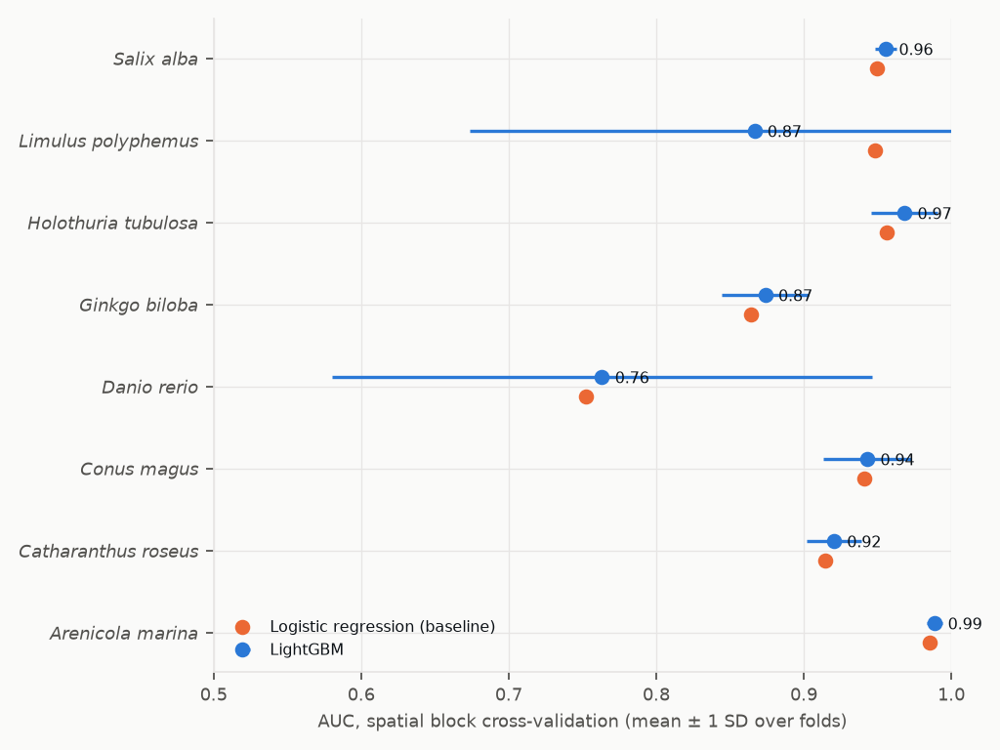
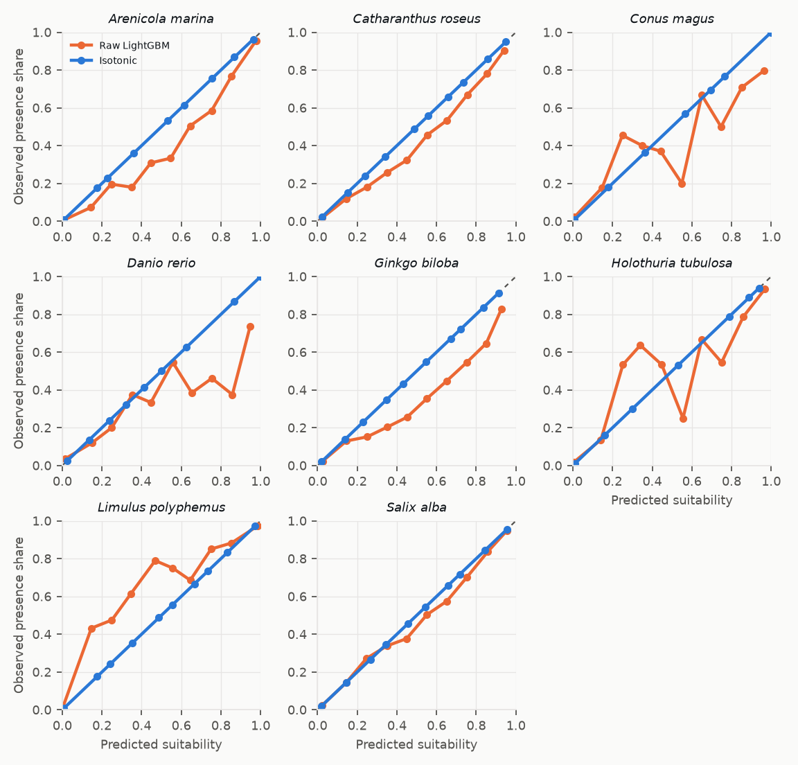
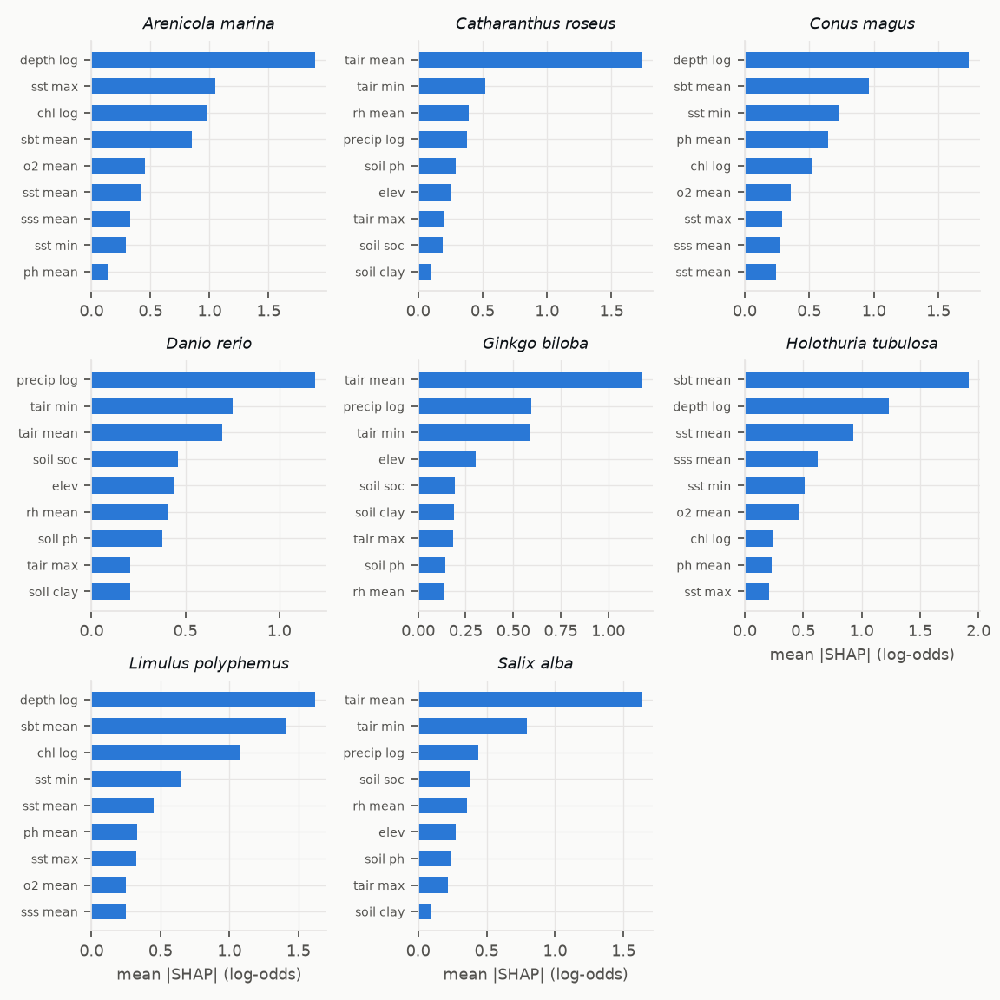

# Model card — BioMed Zones suitability model

> Tables and figures generated by `biomed-ml report` on 2026-10-04 from run `run-20261004-113944`
> (trained 8/9 species, 851,603 scores in 61 s). Narrative sections are maintained by hand in
> `services/ml/biomed_ml/report.py`.

## 1. Intended use

Screening tool to answer *"where in France (Metropole + DROM) could species X be cultivated
sustainably, and why?"*. Outputs are a 0–100 score per H3 cell, a 0–1 confidence, the limiting
factors and the model drivers. Intended users: researchers, aquaculture and agriculture
planners, students. **Not** intended for licensing decisions, site approval or any use without
field validation; protected-area rules must be checked with the managing authority.

## 2. Method (hybrid and decomposable)

1. **Expert score** (rule-based). Per parameter a trapezoid fit: 100 inside the optimal band,
   linear decay to 0 at the tolerance limits, 0 outside. Habitat weights — marine: temperature
   0.30, salinity 0.20, pH 0.20, depth 0.15, O₂ 0.15; terrestrial: temperature 0.30, soil pH
   0.25, humidity 0.20, rainfall 0.15, altitude 0.10; freshwater: water temperature (air proxy)
   1.0. Hard constraints: lethal parameters are checked on monthly extremes (coldest/warmest
   month, lowest salinity or oxygen month, frost days for frost-sensitive plants); a violation
   caps the score at 25.
2. **ML score** (species distribution model). LightGBM per species on GBIF/OBIS presences vs.
   background points, logistic regression with quadratic terms as baseline. Predictors come from
   global layers (Copernicus Marine, ETOPO 2022, TerraClimate, SoilGrids) so that training and
   prediction share one definition. Presences are thinned to one per environmental pixel.
   Background: accessible area of 1,000 km around presences; half target-group background
   (records of the other species of the same group, which share the recording bias — spatial
   bias correction), half area-weighted random points; ratio 3:1 (1,000–10,000 points).
   Validation: **spatial block cross-validation** (5° blocks, 5 folds); TSS uses the threshold
   that maximises TSS on the training folds. Out-of-fold predictions are calibrated with
   isotonic regression. Species with fewer than 30 thinned presences get no model.
3. **Final score**: `final = (0.5·expert + 0.5·ml) × regulatory × human × data`, the blend being
   capped when a hard constraint fails. Regulatory 0.6–1.0 (national park core, Natura 2000,
   marine park; ≥ 50 % strict protection ⇒ excluded), human pressure 0.7–1.0 (artificial land
   share, or distance to port at sea), data 0.7–1.0 (completeness of expert inputs). Confidence
   = completeness × (0.4 + 0.6 × model quality × expert/ML agreement).
4. **Explanations**: exact TreeSHAP values from LightGBM (`pred_contrib`), top 3 per cell.

## 3. Training data

Occurrences: GBIF download https://doi.org/10.15468/dl.sfc2ns and OBIS, filtered (coordinates,
no geospatial issue, ≥ 1970, uncertainty ≤ 10 km or unreported, no living or fossil specimens).
Environmental layers and their provenance: see `docs/DATA_REPORT.md`.

## 4. Metrics (spatial block cross-validation)

| Species | Habitat | Presences | Background | LightGBM AUC | LightGBM TSS | Baseline AUC | Baseline TSS | Status |
|---|---|---|---|---|---|---|---|---|
| *Ambystoma mexicanum* | freshwater | 13 | 998 | — | — | — | — | expert only — 13 thinned presences (< 30): no distribution model; expert score only |
| *Arenicola marina* | marine | 3085 | 9189 | 0.989 ± 0.005 | 0.915 ± 0.034 | 0.985 | 0.907 | trained |
| *Catharanthus roseus* | terrestrial | 5671 | 9937 | 0.920 ± 0.019 | 0.700 ± 0.053 | 0.915 | 0.670 | trained |
| *Conus magus* | marine | 160 | 1000 | 0.943 ± 0.030 | 0.750 ± 0.098 | 0.941 | 0.771 | trained |
| *Danio rerio* | freshwater | 104 | 995 | 0.763 ± 0.183 | 0.443 ± 0.312 | 0.752 | 0.428 | trained |
| *Ginkgo biloba* | terrestrial | 1485 | 4424 | 0.874 ± 0.030 | 0.589 ± 0.047 | 0.864 | 0.573 | trained |
| *Holothuria tubulosa* | marine | 485 | 1442 | 0.968 ± 0.022 | 0.754 ± 0.149 | 0.956 | 0.739 | trained |
| *Limulus polyphemus* | marine | 1573 | 4710 | 0.867 ± 0.193 | 0.511 ± 0.349 | 0.949 | 0.634 | trained |
| *Salix alba* | terrestrial | 7308 | 9891 | 0.956 ± 0.007 | 0.777 ± 0.020 | 0.950 | 0.778 | trained |

Calibration of the out-of-fold predictions, before (orange) and after (blue) isotonic
regression. The blue curve is evaluated on the same out-of-fold predictions the isotonic map was
fitted on, so its closeness to the diagonal is optimistic; the orange curve is the honest view of
the raw model.

Most influential predictors (mean |SHAP|):

| Species | Top 3 predictors |
|---|---|
| *Arenicola marina* | Depth, log10(1 + m), SST warmest month, Chlorophyll-a, log10 |
| *Catharanthus roseus* | Air temperature mean, Coldest-month minimum, Relative humidity |
| *Conus magus* | Depth, log10(1 + m), Bottom temperature, SST coldest month |
| *Danio rerio* | Annual precipitation, log10(1 + mm), Coldest-month minimum, Air temperature mean |
| *Ginkgo biloba* | Air temperature mean, Annual precipitation, log10(1 + mm), Coldest-month minimum |
| *Holothuria tubulosa* | Bottom temperature, Depth, log10(1 + m), SST mean |
| *Limulus polyphemus* | Depth, log10(1 + m), Bottom temperature, Chlorophyll-a, log10 |
| *Salix alba* | Air temperature mean, Coldest-month minimum, Annual precipitation, log10(1 + mm) |

## 5. Honesty rules built into the score

- **Freshwater species** (*Danio rerio*, *Ambystoma mexicanum*): no freshwater layer is in
  scope and both species are non-native; the output is always "controlled indoor cultivation
  only", with the open-environment score capped at 30.
- **Marine species outside their native range** (*Limulus polyphemus* everywhere in France,
  *Conus magus* outside the Indian Ocean territories): open-water culture would be a biological
  introduction; same indoor-only rule.
- **Climate outside survival limits** (e.g. tropical species in Metropole): the hard constraint
  caps the expert score and the cell is labelled indoor-only, even if the ML model disagrees.

## 6. Known limits and biases

- Presence/background SDMs estimate **relative** environmental suitability, not probability of
  occurrence or yield. Calibration aligns scores with the training design, not with prevalence.
- Occurrences of *Ginkgo biloba* and *Catharanthus roseus* are dominated by planted individuals
  (urban trees, gardens): their models describe where the species is *grown*, which is close to
  the question asked but not the natural niche. *Salix alba* records concentrate in Western
  Europe (France alone holds a third).
- *Limulus polyphemus* training data cover only North America; transferring to French waters is
  extrapolation (and the species is non-native). Its LightGBM model is unstable across spatial
  folds (AUC SD ≈ 0.19) and the logistic baseline scores higher; LightGBM is kept for
  consistency of explanations, and every French cell is indoor-only for this species anyway.
- *Danio rerio* (104 thinned presences) has a weak, unstable model (AUC ≈ 0.76).
- *Conus magus* has few records; its tolerance bands are generic tropical-reef ranges.
- Global predictors are coarse (0.083–0.25°): coastal gradients and microclimates are smoothed in
  the ML part; the expert part uses the national higher-resolution layers.
- Tolerance bands are literature-derived approximations (references in
  `data/reference/species.json`) and require validation by domain experts.
- Surface ocean values are used for O₂ and pH; benthic conditions may differ.
- Regulatory modifiers simplify management rules that are site-specific.

## 7. Versioning and retraining

Each run is stored in `model_run` with per-species metrics in `species_metric`; scores of the
active run are precomputed in `score`. Administrators retrain through `POST /admin/retrain`
(API) → `POST /train` (ML service); validated field observations are added to the training data
in the next run (Phase 4).
